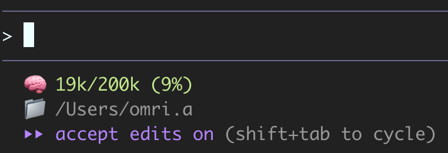

# claude-pulse

> Real-time token usage monitoring for Claude Code status line | **v1.4.0**

**claude-pulse** displays your current Claude Code token usage directly in your status line, helping you stay aware of context consumption without running `/context` manually.

## New in v1.4.0: Model Display

- **Model display** - Shows current model in use (e.g., "Sonnet 4.5", "Opus 4.5", "Haiku 3.5")
- **Single-line output** - Token usage, model name, and working directory on one compact line
- **Accurate display** - Shows FULL context usage matching `/context` command (including MCP tools, system prompt, etc.)

**Note:** >100% is normal when context exceeds the limit - Claude Code will auto-compact.

See [RELEASE.md](RELEASE.md) for full release notes.



## Features

- ✅ **Accurate token counting** - Reads actual usage from Claude's API responses
- ✅ **Model-aware limits** - Automatically detects context limits for different Claude models
- ✅ **Model display** - Shows which Claude model you're using (e.g., "Sonnet 4.5", "Opus 4.5")
- ✅ **Compact display** - Single line showing usage, model, and directory
- ✅ **Color-coded warnings** - Green → Yellow → Red as you approach context limits
- ✅ **Lightweight** - Pure bash script with minimal dependencies
- ✅ **Inspired by [ccusage](https://github.com/ryoppippi/ccusage)** - Uses the same accurate parsing approach

## Demo

```
🧠 72k/200k (36%) · Sonnet 4.5 📁 /Users/you/Code/your-project
```

Displays token usage (current/limit), percentage, current model, and working directory all on one compact line.

Color changes based on usage:
- 🟢 **Green** (0-49%): Plenty of context remaining
- 🟡 **Yellow** (50-79%): Moderate usage
- 🔴 **Red** (80-100%): High usage, consider compacting

## Installation

### macOS / Linux

```bash
git clone https://github.com/omriariav/claude-pulse.git
cd claude-pulse
./install.sh
```

**Requirements**: `jq` (brew install jq / apt install jq)

### Windows (PowerShell)

1. Clone or download the repository
2. Copy `claude-pulse.ps1` to your `.claude` folder:
   ```powershell
   Copy-Item claude-pulse.ps1 "$env:USERPROFILE\.claude\statusline-command.ps1"
   ```

3. Add to your Claude Code `settings.json`:
   ```json
   {
     "statusLine": {
       "type": "command",
       "command": "powershell -ExecutionPolicy Bypass -File C:/Users/YOUR_USERNAME/.claude/statusline-command.ps1"
     }
   }
   ```

4. Restart Claude Code

### Manual Install (macOS/Linux)

1. Copy `claude-pulse` to `~/.claude/statusline-command.sh`:
   ```bash
   cp claude-pulse ~/.claude/statusline-command.sh
   chmod +x ~/.claude/statusline-command.sh
   ```

2. Add to your Claude Code `settings.json`:
   ```json
   {
     "statusLine": {
       "type": "command",
       "command": "~/.claude/statusline-command.sh"
     }
   }
   ```

3. Restart Claude Code

## Requirements

- **Claude Code** (obviously!)
- **macOS/Linux**: `jq` JSON parser
  - macOS: `brew install jq`
  - Linux: `sudo apt-get install jq`
- **Windows**: PowerShell (included in Windows)

## How It Works

### Primary: Billing API via Transcript (Most Accurate)

claude-pulse reads usage data from Claude's transcript files (JSONL format) which contain the actual billing API response. This includes:
- Message tokens
- System prompt tokens
- Tool definitions (including MCP tools)
- Memory files
- All context overhead

This matches what `/context` shows - the FULL context usage.

### Fallback: Native Context Window

If transcript data is unavailable, claude-pulse falls back to the native `context_window` data from Claude Code:

```json
{
  "context_window": {
    "total_input_tokens": 15234,
    "total_output_tokens": 4521,
    "context_window_size": 200000
  }
}
```

The script:
1. Tries to read billing API data from transcript (most accurate)
2. Falls back to native `context_window` if transcript unavailable
3. Extracts and converts model ID to friendly name
4. Calculates percentage and applies color coding
5. Returns a compact, single-line status display

## Supported Models

- Claude Sonnet 4.x (200k context)
- Claude Opus 4 (200k context)
- Claude 3.5 Sonnet (200k context)
- Claude Haiku 3.5 (200k context)
- Unknown models default to 200k

## Configuration

The script automatically detects your model and sets the appropriate context limit. No configuration needed!

## Why Not Use /context?

You can! But claude-pulse offers:
- **Always visible** - No need to run `/context` manually
- **More accurate** - Uses billing API data which reflects actual context consumption
- **Automatic** - Updates with every message
- **Color-coded** - Visual warnings as you approach limits

## Troubleshooting

**Status line shows "No token usage yet"**
- This is normal for new sessions before the first API response
- Wait for Claude's first response

**Script not running**
- Verify `~/.claude/statusline-command.sh` exists and is executable
- Check that `jq` is installed: `which jq`
- Restart Claude Code after configuration changes

**Token count seems off**
- claude-pulse reads from transcript files, which update after each API response
- Small differences (<3%) from `/context` are normal due to timing

## Known Issues

**Small differences from /context**
- Difference is typically 2-3k tokens (~3%)
- Both use context window data, but timing of updates may differ slightly

## Credits

Inspired by [ccusage](https://github.com/ryoppippi/ccusage) by [@ryoppippi](https://github.com/ryoppippi).

## License

MIT License - see [LICENSE](LICENSE) file for details.

## Contributing

Contributions welcome! Please open an issue or PR.

---

**Made with ❤️ for the Claude Code community**
